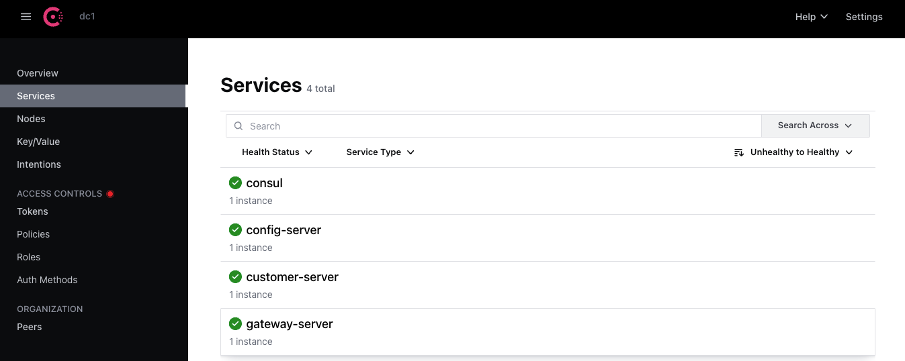

## Micro - Services : 

## <ins> Consul : </ins>
#### 1- Installation : 
Homebrew 
```bash
   $ brew tap hashicorp/tap
   $ brew install hashicorp/tap/consul
```
#### 2- Start the Agent : 
```bash
$ consul agent -dev
```
#### 3- Discover datacenter members:
```bash
consul members
```
#### 4- Stop the agent

```bash
consul leave
```

### Overview


### Services


---
## <ins> H2-DATABASE : </ins>
### Login page


### Cutomer list
